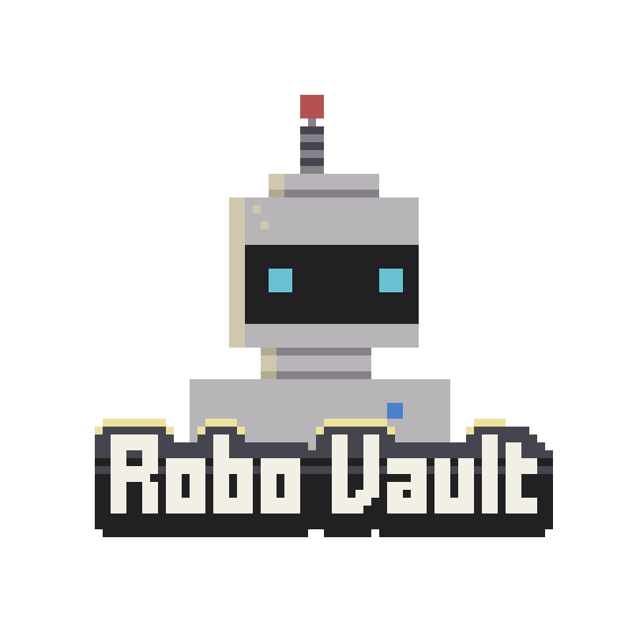

<a name="readme-top"></a>

<!-- PROJECT SHIELDS -->
[![Contributors][contributors-shield]][contributors-url]
[![Forks][forks-shield]][forks-url]
[![Stargazers][stars-shield]][stars-url]
[![Issues][issues-shield]][issues-url]
[![GPLv3 License][license-shield]][license-url]


<!-- PROJECT LOGO -->
<br />
<div align="center">
  <a href="https://github.com/RoboVault/referrals">
    
  </a>

  <h3 align="center">RoboLabs Perp Vault</h3>

  <p align="center">
    Contracts for RoboLabs Perp Vault repo
    <br />
    <a href="https://docs.robo-vault.com/referrals"><strong>Explore the docs »</strong></a>
    <br />
    <br />
    <a href="https://robo-vault.com/brownie-template">Become a referrer</a>
    ·
    <a href="https://github.com/RoboVault/brownie-template/issues">Report Bug</a>
    ·
    <a href="https://github.com/RoboVault/brownie-template/issues">Request Feature</a>
  </p>
</div>


<!-- ABOUT THE PROJECT -->
## RoboLabs Perp Vault Contracts

This repo contains the contracts for the RoboLabs Perp Vault. The strategy employed by the contract is to lend USD-pegged tokens which should be the same price as the `Quote` token, and borrow the `Base` token from Perpetual in order to provide concentrated and automated liquidity on the pair. The fees and rewards collected from this process are compounded. The price range for the position is updated as the price moves through `rebalance` operations. This contract also supports leveraging the position up to 10X in accordance with the perpetual protocol.

<!-- GETTING STARTED -->
## Getting Started

To get started with this project, follow these steps:

1. Clone this repository to your local machine.
2. Install the necessary dependencies by running `npm install`
3. Configure `WETHPERP.sol` to use the parameters you desire.
4. Compile the contracts by running `brownie compile`.
5. Add optimism and fork to brownie running
>brownie networks add development op-fork cmd=ganache-cli host=http://127.0.0.1/ fork=optimism-main accounts=10 mnemonic=brownie port=8545
5. Test the contracts by running 
> brownie test tests/op/test_vault_wrapper.py --network op-fork
6. Lint the code by running `npm run lint`.
### Install Dependencies 

Requires npm and pip. See .github/workflows for suitable versions. 

```sh
npm install
pip install requirements-dev.txt
```

### Build

```sh
brownie compile
```

### test

```sh
brownie test
```

### lint

```sh
npm run lint
```

<!-- MARKDOWN LINKS & IMAGES -->
<!-- https://www.markdownguide.org/basic-syntax/#reference-style-links -->
[contributors-shield]: https://img.shields.io/github/contributors/RoboVault/brownie-template.svg?style=for-the-badge
[contributors-url]: https://github.com/RoboVault/brownie-template/graphs/contributors
[forks-shield]: https://img.shields.io/github/forks/RoboVault/brownie-template.svg?style=for-the-badge
[forks-url]: https://github.com/RoboVault/brownie-template/network/members
[stars-shield]: https://img.shields.io/github/stars/RoboVault/brownie-template.svg?style=for-the-badge
[stars-url]: https://github.com/RoboVault/brownie-template/stargazers
[issues-shield]: https://img.shields.io/github/issues/RoboVault/brownie-template.svg?style=for-the-badge
[issues-url]: https://github.com/RoboVault/brownie-template/issues
[license-shield]: https://img.shields.io/github/license/RoboVault/brownie-template.svg?style=for-the-badge
[license-url]: https://github.com/RoboVault/brownie-template/blob/master/LICENSE.txt